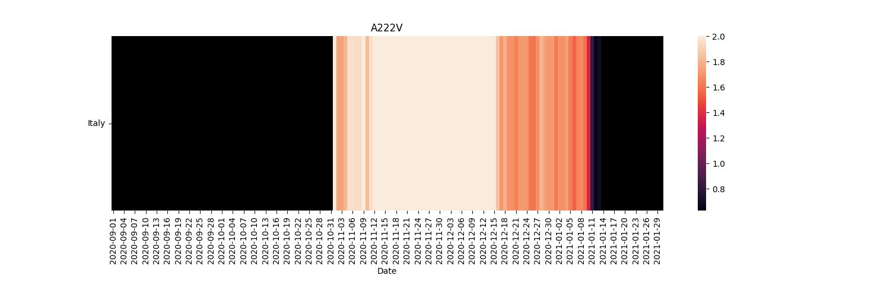
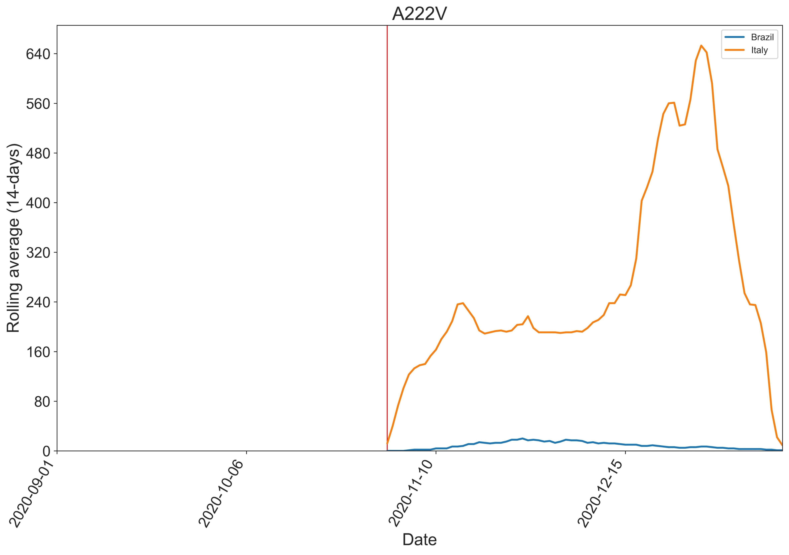

# MuTEXA
### MUTation EXplorer & Analyzer

MuTEXA is a command-line tool for tracking mutations of interest and analysing their temporal dynamics across populations using genomic sequences and associated metadata.

The tool extracts mutations from genomic data, integrates metadata, and generates rolling-average visualisations to explore mutation frequency trends over time.

---

# Overview

MuTEXA processes genomic sequence data together with metadata to:

- Extract mutations of interest from sequence alignments
- Integrate genomic data with sample metadata
- Monitor mutation frequencies over time
- Generate rolling-average visualisations for mutation dynamics

The tool supports **FASTA alignments** and **VCF files** as input formats.

---

# Installation

Clone the repository:

```bash
git clone https://github.com/nehlehk/Mutexa.git
cd Mutexa
```

Create a virtual environment (recommended):
```bash
python3 -m venv venv
source venv/bin/activate
```

Install MuTEXA:
```bash
pip install .
```

Verify installation:
```bash
mutexa --help
```

# Input Files

MuTEXA requires the following input files.

### 1. Alignment file

FASTA or VCF format containing genomic sequences.

Example:
```bash
examples/seqs.fasta
```

### 2. Reference genome

FASTA file containing the reference sequence.

Example:
```bash
examples/refSeq.fasta
```

### 3. Mutation file (CSV)

Defines mutations to track.

**Required fields:**

- **Mutation Name** – unique identifier for the mutation  
- **Position** – genomic position of the mutation  
- **Ref** – reference allele at that position  
- **Alt** – alternate allele  

**Example format:**

| Mutation | Position | Ref | Alt |
|----------|----------|-----|-----|
| A222V    | 222      | A   | V   |


### 4. Metadata file (CSV)

Metadata describing each sequence.

**Required columns:**

- **Accession_id** – must match the sequence identifiers in the FASTA/VCF file  
- **Collection_date** – date when the sample was collected  
- **Location** – geographic location of the sample  

**Optional columns:**

- **lineage**
- **group**

**Example file:**
```bash
examples/metadata.csv
```


### 5. Categorization

Grouping variable used for analysis.

Available options:
```bash
country
continent
lineage
```

# Running MuTEXA

Example command using the provided example data:

```bash
mutexa \
-u examples/mutation.csv \
-a examples/seqs_small.fasta \
-m examples/metadata.csv \
-r examples/refSeq.fasta \
-s 2020-09-01 \
-e 2021-01-30 \
-p example \
-t 0.2 \
-d 14 \
-c country
```


# Command Line Arguments

Required:
```bash
-u, --mut       Mutation file (CSV)
-a, --align     Alignment file (FASTA or VCF)
-m, --meta      Metadata file (CSV)
-c, --cat       Categorization column (country | continent | lineage)

```

Optional:
```bash
-s, --start     Start date (YYYY-MM-DD)
-e, --end       End date
-p, --prefix    Output file prefix
-t, --thresh    Frequency threshold
-d, --days      Sliding window size
-r, --ref       Reference genome (FASTA)

```

# Output

Results are written to the outputs/ directory.

Example outputs:

```bash
outputs/
example_mutlist.csv
example_hapdict.csv
example_ratioData.csv
example_countryRatios_0.2.csv
example_country_plot.pdf

```

## Visualisations

MuTEXA generates visualisations to explore mutation dynamics over time.

### Heatmap Example

An example heatmap showing mutation frequency patterns across categories.



---

### Rolling Average Plot Example

An example rolling average plot illustrating the temporal dynamics of a mutation.




# Example Data

Example datasets are included in the repository to allow immediate testing.

```bash
examples/
mutation.csv
metadata.csv
refSeq.fasta
seqs_small.fasta

```

These files allow users to run MuTEXA directly after installation.


# Repository Structure

```bash
Mutexa
│
├── examples
│   ├── mutation.csv
│   ├── metadata.csv
│   ├── refSeq.fasta
│   └── seqs_small.fasta
│
├── images
│
├── src
│   └── mutexa
│       ├── cli.py
│       ├── check_format.py
│       ├── extract_mutations.py
│       ├── merge_meta.py
│       └── rollingAvePlots.py
│
├── pyproject.toml
├── README.md
└── .gitignore

```


# License

Specify the license for MuTEXA (e.g. MIT License).


# Citation

If you use MuTEXA in your research, please cite the associated publication.

```bash
Citation details will be added after publication.
```

# Contact

For issues, feature requests, or questions, please open an issue on GitHub.

https://github.com/nehlehk/Mutexa/issues


