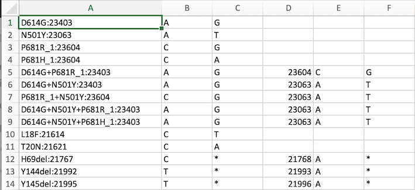
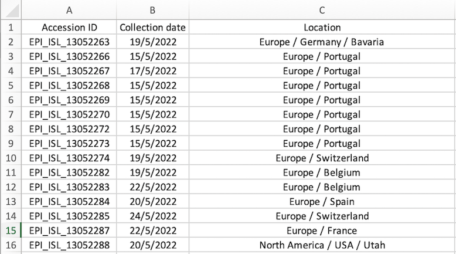

# Mutation Tracking Tutorial

## Introduction

This tutorial provides an overview of the mutation tracking pipeline to extract mutations of interest and calculate the increase versus a wildtype allele over a specified time period.

The data for this tutorial can be accessed on [GitHub](https://bitbucket.csiro.au/users/jai014/repos/strepifun/browse/ExampleData?at=dev).

## Tool Versions

1. Webserver (webserver address)
2. Standalone (this github)


## Required Input Files

1. Alignment file in FASTA or VCF format
2. Reference file in FASTA format
3. Mutations file in CSV format:
    - Mutation Name: A unique identifier for the mutation.
    - Position: The genomic position of the mutation.
    - Ref: The reference allele at the mutation position.
    - Alt: The alternate allele at the mutation position.
    - Example input:

        

4. Metadata file in CSV format:
    - Accession_id: Identifier for the sample. Accession_id should be the same as the accession_id in the fasta/VCF file.
    - Collection Date: Date when the sample was collected.
    - Location: Geographical location, including country and state.
    - Optional columns may include Lineage or Group.

        Example file:

        
5. Categorizing: Categorizing class. Avaiable options: country/continent/lineage 
## Optional Parameters

- Start date: Starting date for filtering metadata (Default: 365 days before today)
- End date: Ending date for filtering metadata (Default: today)
- Threshold: Threshold for filtering haplotypes by frequency (Default: 0)
- Days: Window size for monitoring the mutation
- Prefix: Prefix to save outputs (Default: 'output')

## Standalone Version

The pipeline is equipped with essential libraries, automatically installing them on your machine if they are not already present. Simply execute the pipeline, and it will take care of the necessary installations for you.

## Usage

Change the directory to the current folder and then use this command to see the help:

```bash
./pipeline [-h]
```

To see the reguired input use this command: 

```bash
./pipeline.sh [-h] -u <mut_file> -a <align_file> -m <meta_file> -r <ref_genome> -s <start_date> -e <end_date> -p <prefix> -t <threshold> -d <days> -c <Categorizing>
```
Let's run the pipeline using the example data: 
```bash
./pipeline.sh -u ExampleData/mutation.csv -a ExampleData/seqs.fasta -m ExampleData/metadata.csv -r ExampleData/refSeq.fasta -s 2020-09-01 -e 2021-01-30 -p example -t .2 -d 14 -c country
```

## Output
- Heatmap plots. Here is an example of a heatmap plot from the example data:
     <br> 

  - Rolling average plots. Here is an example of a rolling average plot from the example data:
      <br> 


      

